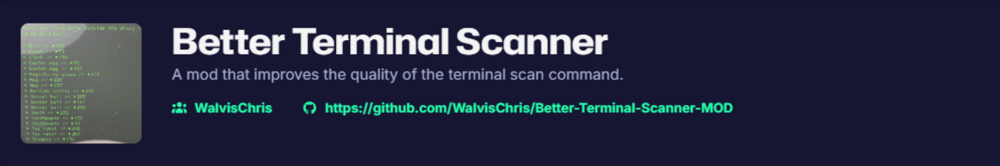
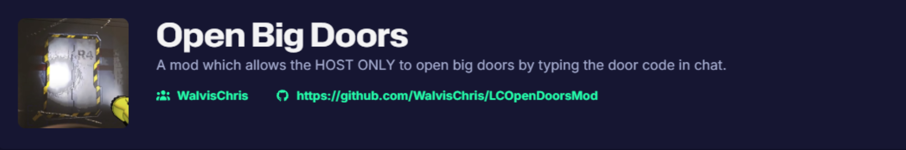

# Hello there!

I'm Chris, a cyber security student who does programming / computer science for a hobby.

# Mods - Supermarket  
[View my Thunderstore page](https://thunderstore.io/c/supermarket-together/p/WalvisChris/)  
  

# Mods - Lethal Company  
[View my Thunderstore page](https://thunderstore.io/c/lethal-company/p/WalvisChris/)  
  
  
  
  
  

# Minecraft Repo's
   
  
  
  
  
  
   

# IoT / Computer Science / Python
  
  
  
  
  
  
  
  

# School
  
  
  

# Github Pages

  
